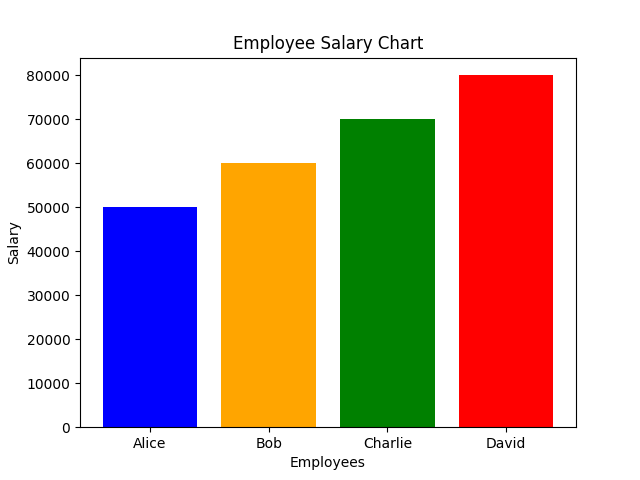

# Exercise 02  

## Study of Python Libraries for ML Applications such as Pandas and Matplotlib  

### Aim  

To explore and experiment with Python libraries **Pandas** and **Matplotlib**, which are commonly used in Machine Learning applications.  

### Procedure/Program  

#### **Pandas Example:**  

```python
import pandas as pd

# sample dataset
data = {
    "Name": ["Alice", "Bob", "Charlie", "David"],
    "Age": [25, 30, 35, 40],
    "Salary": [50000, 60000, 70000, 80000]
}

# DataFrame
df = pd.DataFrame(data)

print("DataFrame:\n", df)

# basic operations
print("\nDescriptive Statistics:\n", df.describe())
print("\nSelecting Age Column:\n", df["Age"])
print("\nFiltering Rows where Age > 30:\n", df[df["Age"] > 30])
```

#### **Matplotlib Example:**  

```python
import matplotlib.pyplot as plt

# sample data
names = ["Alice", "Bob", "Charlie", "David"]
salaries = [50000, 60000, 70000, 80000]

# bar chart
plt.bar(names, salaries, color=['blue', 'orange', 'green', 'red'])
plt.xlabel("Employees")
plt.ylabel("Salary")
plt.title("Employee Salary Chart")
plt.show()
```

### Output/Explanation  

- **Output:**  
  The program demonstrates basic functionalities of Pandas and Matplotlib. Expected outputs:  

  **Pandas Output:**  

  ```bash
  DataFrame:
        Name  Age  Salary
  0    Alice   25   50000
  1      Bob   30   60000
  2  Charlie   35   70000
  3    David   40   80000

  Descriptive Statistics:
              Age        Salary
  count   4.000000      4.000000
  mean   32.500000  65000.000000
  std     6.454972  12909.944487
  min    25.000000  50000.000000
  25%    28.750000  57500.000000
  50%    32.500000  65000.000000
  75%    36.250000  72500.000000
  max    40.000000  80000.000000

  Selecting Age Column:
  0    25
  1    30
  2    35
  3    40
  Name: Age, dtype: int64

  Filtering Rows where Age > 30:
         Name  Age  Salary
  2  Charlie   35   70000
  3    David   40   80000
  ```

  **Matplotlib Output:**  
    
  - A **bar chart** displaying employee names on the x-axis and their salaries on the y-axis.  

- **Explanation:**  
  - **Pandas** provides functionalities for data manipulation and analysis.  
  - **Matplotlib** is used for data visualization, helping to represent trends and patterns graphically.  
  - The Pandas example demonstrates DataFrame creation, data selection, and basic analysis.  
  - The Matplotlib example showcases how to create a simple bar chart.
