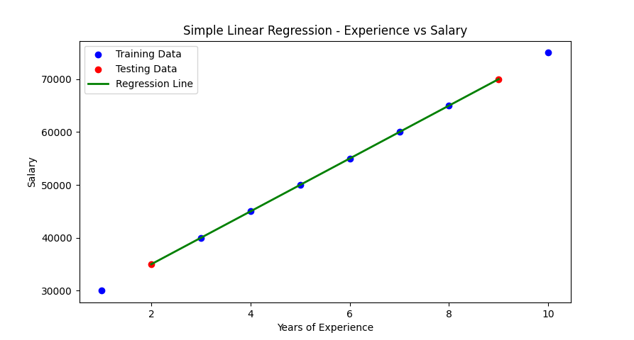

# Exercise 03 

## Implementation of Simple Linear Regression in Python  

### Aim  

To implement **Simple Linear Regression** using Python to predict values based on a given dataset.  

### Procedure/Program  

```python
import numpy as np
import matplotlib.pyplot as plt
from sklearn.model_selection import train_test_split
from sklearn.linear_model import LinearRegression
from sklearn.metrics import mean_squared_error, r2_score

# sample dataset (Experience vs Salary)
experience = np.array([1, 2, 3, 4, 5, 6, 7, 8, 9, 10]).reshape(-1, 1)
salary = np.array([30000, 35000, 40000, 45000, 50000, 55000, 60000, 65000, 70000, 75000])

# data into training and testing sets
X_train, X_test, y_train, y_test = train_test_split(experience, salary, test_size=0.2, random_state=42)

# Linear Regression model
model = LinearRegression()
model.fit(X_train, y_train)

# predicting values
y_pred = model.predict(X_test)

# model evaluation
mse = mean_squared_error(y_test, y_pred)
r2 = r2_score(y_test, y_pred)

print("Model Coefficient (Slope):", model.coef_[0])
print("Model Intercept:", model.intercept_)
print("Mean Squared Error:", mse)
print("R-squared Score:", r2)

# regression line
plt.scatter(X_train, y_train, color='blue', label="Training Data")
plt.scatter(X_test, y_test, color='red', label="Testing Data")
plt.plot(X_test, y_pred, color='green', linewidth=2, label="Regression Line")
plt.xlabel("Years of Experience")
plt.ylabel("Salary")
plt.title("Simple Linear Regression - Experience vs Salary")
plt.legend()
plt.show()
```

### Output/Explanation  

- **Output:**
  
  

  ```bash
  Model Coefficient (Slope): 4999.999999999999
  Model Intercept: 25000.000000000004
  Mean Squared Error: 0.0
  R-squared Score: 1.0
  ```

  The program trains a **Simple Linear Regression model** and predicts salaries based on years of experience. Expected output includes:  
  - Model parameters (Slope & Intercept)  
  - Evaluation metrics like **Mean Squared Error (MSE)** and **R-squared score (R²)**  
  - A **scatter plot** with training and testing data along with the regression line.  

- **Explanation:**  
  - The dataset contains **Years of Experience** as input (`X`) and **Salary** as output (`y`).  
  - The data is **split** into training and testing sets using `train_test_split()`.  
  - A **Linear Regression model** is created using `LinearRegression()` and trained on the dataset.  
  - The model predicts salaries for the test set and evaluates performance using **MSE and R² score**.  
  - A **regression line** is plotted to visualize the model's predictions.
