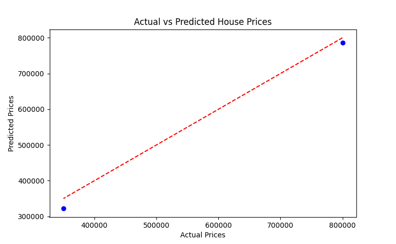

# Exercise 02

## Implement Linear Regression using Python

### Aim  

To implement the linear regression algorithm using Python.

### Theory

Linear regression is a statistical method used to model the relationship between a dependent variable and one or more independent variables. In simple linear regression, the relationship is modeled as a straight line:

$$y = \beta_0 + \beta_1 \cdot x + \epsilon$$

Where:

- `y` is the dependent variable (target).  
- `x` is the independent variable (predictor).  
- `β0` is the intercept.  
- `β1` is the slope of the line (coefficient).  
- `ε` is the error term.  

Linear regression aims to find the optimal values of `β0` and `β1` that minimize the difference between the predicted values and the actual values.

### Procedure/Program  

```python
import numpy as np
import matplotlib.pyplot as plt
from sklearn.linear_model import LinearRegression
from sklearn.model_selection import train_test_split
from sklearn.metrics import mean_squared_error

# generate some synthetic data for linear regression
np.random.seed(42)
X = np.random.rand(100, 1) * 10            # independent variable (e.g., hours of study)
y = 2.5 * X + np.random.randn(100, 1) * 2  # dependent variable (e.g., test score)

X_train, X_test, y_train, y_test = train_test_split(X, y, test_size=0.2, random_state=42)
model = LinearRegression()
model.fit(X_train, y_train)
y_pred = model.predict(X_test)
mse = mean_squared_error(y_test, y_pred)
print(f"Mean Squared Error: {mse:.2f}")

# plot the regression line and the data points
plt.scatter(X, y, color='blue', label='Data points')
plt.plot(X_test, y_pred, color='red', label='Regression line')
plt.xlabel('Hours of Study')
plt.ylabel('Test Score')
plt.title('Linear Regression Example')
plt.legend()
plt.show()
```

### Output/Explanation  

Output:  

The program outputs:  

```bash
Mean Squared Error: 2.61
```



Explanation:  

- Synthetic data is generated with a linear relationship between `X` (hours of study) and `y` (test score), with some noise.  
- The data is split into training and test sets.  
- A `LinearRegression` model is initialized and trained using the training data.  
- Predictions are made on the test data, and the performance of the model is evaluated using Mean Squared Error (MSE).  
- The regression line is plotted alongside the data points, visually showing how well the model fits the data.
