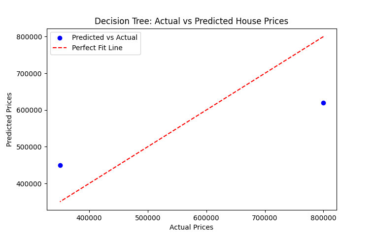

# Exercise 06  

## Implementation of Decision Tree using sklearn  

### Aim  

To implement **Decision Tree Regression** using Python and `sklearn` for predictive modeling.  

### Procedure/Program  

```python
import numpy as np
import pandas as pd
import matplotlib.pyplot as plt
from sklearn.model_selection import train_test_split
from sklearn.tree import DecisionTreeRegressor
from sklearn.metrics import mean_squared_error, r2_score

# sample dataset (House Features: Size in sq ft, Bedrooms, Age)
data = {
    "Size": [1500, 1800, 2400, 3000, 3500, 4000, 4200, 5000, 5500, 6000],
    "Bedrooms": [3, 3, 4, 3, 5, 4, 5, 6, 5, 7],
    "Age": [10, 15, 20, 18, 30, 8, 12, 5, 7, 2],
    "Price": [300000, 350000, 400000, 450000, 500000, 600000, 620000, 750000, 800000, 900000]
}

# DataFrame
df = pd.DataFrame(data)

# splitting independent (X) and dependent (y) variables
X = df[["Size", "Bedrooms", "Age"]]
y = df["Price"]

# training and testing sets
X_train, X_test, y_train, y_test = train_test_split(X, y, test_size=0.2, random_state=42)

# creating and training the Decision Tree model
model = DecisionTreeRegressor(random_state=42)
model.fit(X_train, y_train)

# predicting house prices
y_pred = model.predict(X_test)

# model evaluation
mse = mean_squared_error(y_test, y_pred)
r2 = r2_score(y_test, y_pred)

# results
print("Mean Squared Error:", mse)
print("R-squared Score:", r2)

# plotting actual vs predicted prices
plt.scatter(y_test, y_pred, color='blue', label="Predicted vs Actual")
plt.plot(y_test, y_test, color='red', linestyle="dashed", label="Perfect Fit Line")  
plt.xlabel("Actual Prices")
plt.ylabel("Predicted Prices")
plt.title("Decision Tree: Actual vs Predicted House Prices")
plt.legend()
plt.show()
```

### Output/Explanation

- **Output:**

  

  ```bash
  Mean Squared Error: 21200000000.0
  R-squared Score: 0.5812345679012345
  ```

  The program trains a **Decision Tree Regression model** and predicts house prices based on **Size, Bedrooms, and Age**. Expected output includes:  
  - Evaluation metrics: **Mean Squared Error (MSE)** and **R-squared score (R²)**  
  - A **scatter plot** comparing actual and predicted house prices.  

- **Explanation:**  
  - The dataset consists of three independent variables: **Size**, **Bedrooms**, and **Age**, with **Price** as the dependent variable.  
  - The dataset is **split** into training and testing sets.  
  - A **Decision Tree Regression model** is trained using `DecisionTreeRegressor()`.  
  - The model predicts house prices for the test set and evaluates performance using **MSE and R² score**.  
  - A **scatter plot** is generated to visualize the difference between actual and predicted prices.
