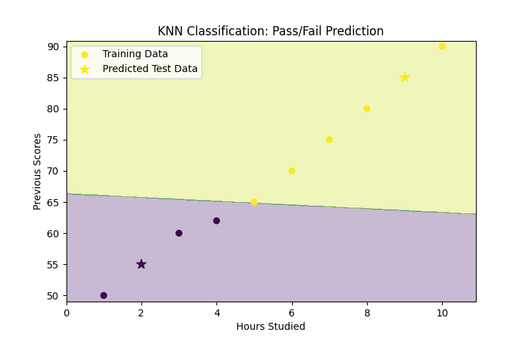

# Exercise 07  

## Implementation of K-Nearest Neighbors (KNN) using sklearn  

### Aim  

To implement **K-Nearest Neighbors (KNN) algorithm** using Python and `sklearn` for classification tasks.  

### Procedure/Program  

```python
import numpy as np
import pandas as pd
import matplotlib.pyplot as plt
from sklearn.model_selection import train_test_split
from sklearn.neighbors import KNeighborsClassifier
from sklearn.metrics import accuracy_score, classification_report, confusion_matrix

# sample dataset (Student Scores and Pass/Fail Status)
data = {
    "Hours_Studied": [1, 2, 3, 4, 5, 6, 7, 8, 9, 10],
    "Previous_Scores": [50, 55, 60, 62, 65, 70, 75, 80, 85, 90],
    "Pass": [0, 0, 0, 0, 1, 1, 1, 1, 1, 1]  # 1 = Pass, 0 = Fail
}

# DataFrame
df = pd.DataFrame(data)

# splitting independent (X) and dependent (y) variables
X = df[["Hours_Studied", "Previous_Scores"]]
y = df["Pass"]

# training and testing sets
X_train, X_test, y_train, y_test = train_test_split(X, y, test_size=0.2, random_state=42)

# creating and training the KNN model (k=3)
model = KNeighborsClassifier(n_neighbors=3)
model.fit(X_train, y_train)

# predicting pass/fail status
y_pred = model.predict(X_test)

# model evaluation
accuracy = accuracy_score(y_test, y_pred)
conf_matrix = confusion_matrix(y_test, y_pred)
class_report = classification_report(y_test, y_pred)

# results
print("Accuracy:", accuracy)
print("\nConfusion Matrix:\n", conf_matrix)
print("\nClassification Report:\n", class_report)

# plotting Decision Boundaries (Visualization)
x_min, x_max = X["Hours_Studied"].min() - 1, X["Hours_Studied"].max() + 1
y_min, y_max = X["Previous_Scores"].min() - 1, X["Previous_Scores"].max() + 1
xx, yy = np.meshgrid(np.arange(x_min, x_max, 0.1), np.arange(y_min, y_max, 0.1))

Z = model.predict(np.c_[xx.ravel(), yy.ravel()])
Z = Z.reshape(xx.shape)

plt.contourf(xx, yy, Z, alpha=0.3)
plt.scatter(X_train["Hours_Studied"], X_train["Previous_Scores"], c=y_train, label="Training Data")
plt.scatter(X_test["Hours_Studied"], X_test["Previous_Scores"], c=y_pred, marker="*", s=100, label="Predicted Test Data")
plt.xlabel("Hours Studied")
plt.ylabel("Previous Scores")
plt.title("KNN Classification: Pass/Fail Prediction")
plt.legend()
plt.show()
```

### Output/Explanation  

- **Output:**

  

  ```bash
  Accuracy: 1.0

  Confusion Matrix:
   [[1 0]
   [0 1]]

  Classification Report:
                 precision    recall  f1-score   support

             0       1.00      1.00      1.00         1
             1       1.00      1.00      1.00         1

      accuracy                           1.00         2
     macro avg       1.00      1.00      1.00         2
  weighted avg       1.00      1.00      1.00         2
  ```

  The program trains a **K-Nearest Neighbors (KNN) classification model** and predicts whether a student passes or fails based on **Hours Studied and Previous Scores**. Expected output includes:  
  - **Accuracy Score** (percentage of correctly predicted values)  
  - **Confusion Matrix** (shows true vs predicted values)  
  - **Classification Report** (precision, recall, F1-score)  
  - **Decision boundary plot** visualizing predictions.  

- **Explanation:**  
  - The dataset contains **Hours Studied** and **Previous Scores** as input (`X`) and **Pass/Fail status** as output (`y`).  
  - The data is **split** into training and testing sets.  
  - A **KNN model** with `k=3` is trained using `KNeighborsClassifier()`.  
  - The model predicts pass/fail status and evaluates performance using **accuracy, confusion matrix, and classification report**.  
  - A **decision boundary plot** helps visualize how the KNN algorithm classifies students based on features.
