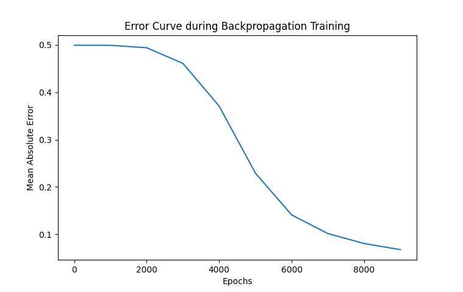

# Exercise 10

## Building an Artificial Neural Network (ANN) using Backpropagation

### Aim

To build a basic **Artificial Neural Network (ANN)** and implement the **Backpropagation** algorithm for training using Python.

### Procedure/Program

```python
import numpy as np
import matplotlib.pyplot as plt

# sigmoid activation function
def sigmoid(x):
    return 1 / (1 + np.exp(-x))

# derivative of sigmoid function
def sigmoid_derivative(x):
    return x * (1 - x)

# training dataset: Logical XOR Problem
X = np.array([
  [0, 0],
  [0, 1],
  [1, 0],
  [1, 1]])

y = np.array([[0], [1], [1], [0]])

# initialize neural network parameters
input_layer_neurons = X.shape[1]  # 2 features (X1 and X2)
hidden_layer_neurons = 4          # Number of neurons in the hidden layer
output_layer_neurons = 1          # Output layer (binary classification)

# initialize weights and biases
np.random.seed(42)
hidden_weights = np.random.rand(input_layer_neurons, hidden_layer_neurons)
hidden_bias = np.random.rand(1, hidden_layer_neurons)
output_weights = np.random.rand(hidden_layer_neurons, output_layer_neurons)
output_bias = np.random.rand(1, output_layer_neurons)

# learning rate
learning_rate = 0.1
epochs = 10000

# list to store error history for plotting
error_history = []

# training the ANN using Backpropagation
for epoch in range(epochs):
    # forward Propagation
    hidden_layer_input = np.dot(X, hidden_weights) + hidden_bias
    hidden_layer_output = sigmoid(hidden_layer_input)

    output_layer_input = np.dot(hidden_layer_output, output_weights) + output_bias
    predicted_output = sigmoid(output_layer_input)

    # backpropagation (Error Calculation)
    error = y - predicted_output
    d_predicted_output = error * sigmoid_derivative(predicted_output)

    # error at Hidden Layer
    error_hidden_layer = d_predicted_output.dot(output_weights.T)
    d_hidden_layer = error_hidden_layer * sigmoid_derivative(hidden_layer_output)

    # update weights and biases using Gradient Descent
    output_weights += hidden_layer_output.T.dot(d_predicted_output) * learning_rate
    output_bias += np.sum(d_predicted_output, axis=0, keepdims=True) * learning_rate
    hidden_weights += X.T.dot(d_hidden_layer) * learning_rate
    hidden_bias += np.sum(d_hidden_layer, axis=0, keepdims=True) * learning_rate

    # append the mean error to error_history
    if epoch % 1000 == 0:
        error_history.append(np.mean(np.abs(error)))
        print(f"Epoch {epoch} | Error: {np.mean(np.abs(error))}")

# final predictions after training
print("\nFinal Predicted Output:")
print(predicted_output)

# plotting the error curve
plt.plot(range(0, epochs, 1000), error_history)  # only plot every 1000th epoch
plt.xlabel("Epochs")
plt.ylabel("Mean Absolute Error")
plt.title("Error Curve during Backpropagation Training")
plt.show()
```

### Output/Explanation

- **Output:**

  

  ```bash
  Epoch 0 | Error: 0.49914791405546904
  Epoch 1000 | Error: 0.4989908274224632
  Epoch 2000 | Error: 0.4939211220442684
  Epoch 3000 | Error: 0.46086324847622706
  Epoch 4000 | Error: 0.3708114875497051
  Epoch 5000 | Error: 0.22936859341508167
  Epoch 6000 | Error: 0.14117007926640446
  Epoch 7000 | Error: 0.10187019467760633
  Epoch 8000 | Error: 0.08085064924133498
  Epoch 9000 | Error: 0.067907182961121

  Final Predicted Output:
  [[0.04690963]
   [0.95663392]
   [0.92548675]
   [0.07177571]]
  ```

  The program builds an **Artificial Neural Network (ANN)** with 2 input neurons, 1 hidden layer with 4 neurons, and 1 output neuron. The **Backpropagation** algorithm is used to update weights and biases during training.

  - **Epoch-wise error:** The error (mean absolute error) for every 1000 epochs is printed during training.
  - **Final Predicted Output:** After training is complete, the predicted output for the XOR problem is displayed.
  - **Error Curve:** A plot is generated showing the error reduction during training.

- **Explanation:**
  - The **training dataset** used here is the **XOR problem**, where the inputs `X` are 2 binary variables, and the output `y` is the XOR of those inputs.
  - **Sigmoid activation function** is used for both the hidden and output layers.
  - The **forward propagation** step calculates the outputs of the hidden and output layers.
  - The **backpropagation** step calculates the error between the predicted output and the actual output, and adjusts the weights using the **gradient descent** algorithm.
  - The **weights** and **biases** are updated in each epoch to minimize the error.
  - The **error curve** shows the decrease in error as the network learns to predict the output accurately.

This program illustrates how to implement a simple neural network with backpropagation for binary classification tasks (such as XOR). The network learns over multiple epochs and minimizes error using the **Gradient Descent** technique.
